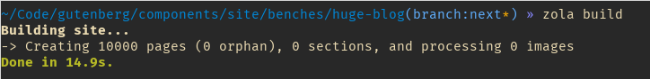
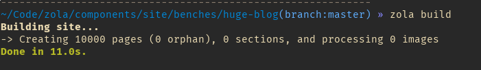

+++
title = "Zola 0.6.0: start of multi-lingual sites"
description = "Zola gets the beginning of multi-lingual support and perf improvements"
+++

[Zola](https://www.getzola.org) is a powerful static site generator (SSG)
inspired by [Hugo](https://gohugo.io/) but simpler to use. One of its goals is to try
to do as much as possible at built time: anchors, search, Sass, table of contents, syntax highlighting and more.
It is highly flexible and allows you to do any kind of sites:

- a blog like the one you are reading right now
- a landing page
- a knowledge base
- a gitbook: see the [book theme](https://github.com/getzola/book)
- a documentation site for your library like the one for [Zola](https://www.getzola.org)

You can find an up-to-date comparison of Zola with other SSG [on the README](https://github.com/getzola/zola#comparisons-with-other-static-site-generators).

## What's new

As usual, you can find the list of changes in the [CHANGELOG](https://github.com/getzola/zola/blob/master/CHANGELOG.md#060-unreleased) but we are going to have a look at the highlights in this post.

### Multi-lingual sites

One of the most requested features is now starting to make its way in Zola!
As a recap, multi-lingual sites are sites available in multiple languages - surprising I know. In terms of Zola, this means
your content is written in multiple languages and that you can switch between them when possible. The approach taken is to have
the language code written in the filename: a `blog-post.md` can have a `blog-post.fr.md` for its French version.

A more complete guide is available in the [documentation](https://www.getzola.org/documentation/content/multilingual/).

Something to keep in mind is that this feature is likely to change in the future as more users use it and report their needs.
There are a few things missing:

- translations inside the templates, using something like [fluent](https://projectfluent.org/)
- taxonomies are currently language specific, which doesn't really work if you want to have a taxonomy called
categories and have `en-US` and `en-GB` languages for example as it will conflict

## Performance improvement

In the 0.5.0 release post, I posted a screenshot of Zola building a test site.

> It is a blog with 10000 pages, paginated by 5 with several taxonomies (one of them having a RSS feed).
Each page contains shortcode, syntax highlighting and, although not used in the templates in this cases, a table of contents.

 

In 0.6.0, it is now a bit faster:

 

The most important difference is that it is now using about **1/4 of the memory** it used to use.

Disabling syntax highlighting runs the same benchmark in about 5 seconds so there isn't too much overhead 
on the Zola side.

## What's next

Work is going to continue on the multi-lingual front based on the feedback received.

Another thing will be a `zola check` command to check that the site is in a good state without building it.
This will check all links (internal and external), duplicate pages, templates, Sass files and report any errors.
This is mostly built to replace the current external link checker which isn't very useable in its current state.

I am also trying to move more features related issues to the [forum](https://zola.discourse.group/) in order to keep the repository
issues be mostly bug reports.

Lastly, I would also love more help on the documentation side as there were some reports the current structure is confusing.
